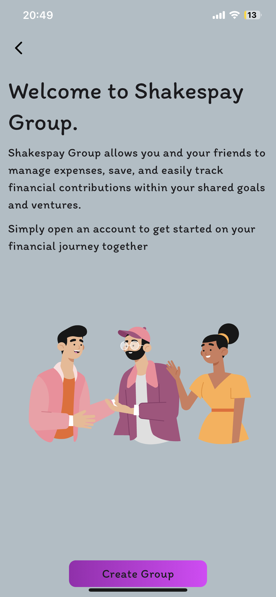
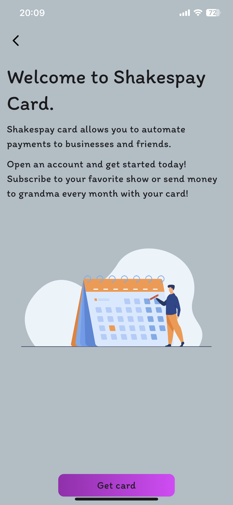
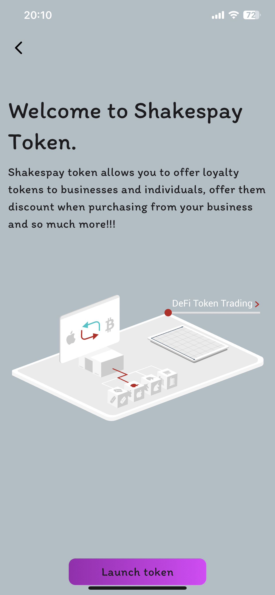
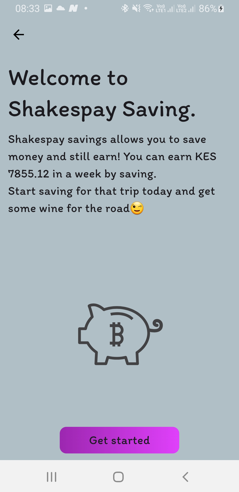

# Shakesco Smartcontracts

- [Shakesco Smartcontracts](#shakesco-smartcontracts)
  - [Contracts](#contracts)
    - [Deploy](#deploy)
    - [Tests](#tests)
    - [Features](#features)

Shakesco has built [__Shakespay__](https://shakesco.netlify.app/) an erc4337 smart wallet on Ethereum and Polygon. No seed phrases, Multi-party Computation(MPC), recurring payments, stealth payments, NFTs and tokens creation(Loyalty program), bound collectibles, built in marketplace and so much more! Our goal is to make Ethereum user-friendly and secure. Join our [__pre-release__](https://twitter.com/shakespay) today and try it out!!!!


## Contracts

_Some contracts have not been open-sourced. This will be done in the coming weeks._

Here are the contracts addresses on Polygon:
  1. "FromShakesco.sol": "0x403302B37D2C29CA37f0b0BbCf1591F2dc2E7d22"
  2. "Account Factory": "0x12ea9e146902cBc0cbd6A205Dd99f88b3dbD321a"
  3. "Savings Factory": "0x00cebBCb1D599F7cDd4e429840E6d36f7b10f471"
  4. "Business Factory": "0x59D6951f45C89fC0f75294AE0D1823fF650621E1"
  5. "Business Token Factory": "0x28413C4618b7fD2d784BEBca21F6995085cacF53"
  6. "Business NFT Factory": "0xFddd49B619043fd2bB4C249f17DD28312A574713"
  7. "Business Saving Factory": "0x1beBa8543d6F9Fae233c0880f340A99e54c85E14"
  8. "Delegate Factory": "0x6B2346AA0750F48B442EB3400F54793D7e381cEd"
  9. "Autopayment Factory": "0xbDd2647578712159Cb60cf57618d7B0ff99832f8"
  10. "Business Delegate Factory": "0xFa542278Bf05fa1882cA7cd15Db0b1930D31fED4"
  11. "Business Autopayment Factory": "0x99350E4F5e934c7b66DE2D0B0F14Ce3e161f2D00"
  12. "Username": "0x3D134E5e7B8239AB76478B359092a988e69eE55e"
  13. "Private": "0x30045daEb3eCea157408C21c318A29d2D9Cf0410"
  14. "Register automation": "0xF4EA3CFE1470C0739600F4d57dA058d70C9e09c1"
  15. "Group Factory": "0x71F60c2bc1496ba21c2d3955C77E7796e439B778"
  16. "Swap": "0x59E3509Fa4f5228ea2a582533CC872eb9FB8B00A"
  
Here are the contracts addresses on Ethereum(Once that are not similar to Polygon):
  1. "FromShakesco.sol": "0x55ba8D9806583606504BDAc0A4ec66a1D88D1619"
  2. "Delegate Factory": "0x74A373011D0E7068F1C71aceE4e9dA23E1628a0c"
  3.  "Business Delegate Factory": "0x002E401b8BAC832AdF3686D5394D22B937C80d9E"
  4.  "Business Autopayment Factory": "0xaca39669bEBf65C934bEeb84ecD1bD842E6Bd3cf"
  5.  "Register automation": "0x9FD92917d2AE4d766b54cc103E0A4f38688F27A7"
  6.  "Group Factory": "0xE859d17685Bf0D56F2b112ff7d0FCe2276E85545"
  7.  "Swap": 0xa6E9774BF73753D8d019895Ec94E33F19A02d28b

We have 6 folders that hold the main logic:

1. __Business__ - Holds the business logic for business accounts
2. __Factory__  - Holds contracts that will help users and business deploy their accounts(contracts)
3. __Mock__ - Just for testing purposes
4. __Shakesco__ - Holds contracts that shakesco offers to both businesses and indivisual
5. __Users__ - Holds logic for users accounts

---

### Deploy

---

We used hardhat for deployment. To learn more: [__Hardhat__](https://hardhat.org/tutorial "Hardhat Tutorial")

Contracts have been deployed on both mainnet and testnet.

- _Mumbai_ and _mainnet_ for __Polygon__
- _Sepolia_ and _mainnet_ for __Ethereum__

After cloning try:
> 💡Tip: Run `npm install` to add hardhat locally

```shell
npx hardhat deploy
```

For deployment on testnet or mainnet:

```shell
npx hardhat deploy --network <network of choice>
```


---

### Tests

---

Test had to be done in two ways to save cost:

- Tests done locally that don't require userop
- Test on useop have been done with [__Biconomy__](https://docs.biconomy.io/dashboard "BiconomyAPI")
  
> 💡Tip: For this section you need api keys from either [__Alchemy__](https://www.alchemy.com/learn/account-abstraction "AlchemyAA") or [__Biconomy__](https://docs.biconomy.io/dashboard "BiconomyAPI"). We recommend Stackup.

After getting your apikeys:

```shell
npx hardhat test
```

### Features

_Here we are going to cover exciting featues built by shakesco._

<div>




</div>


1. Send and receive/request - We have the basic features in every EOA wallet inside the wallet.
2. Recurring payments on Ethereum - We are excitted about this, you can now perform auto-payments on Ethereum. Check out our [documentation](https://github.com/shakesco/shakesco-automation) on how it works and how you can start to receive auto-payments on Ethereum. 
3. Private transaction - Credit to [umbra](https://github.com/ScopeLift/umbra-protocol/) we use their registry to register keys so that business and users can perform private transactions. Check out our package [shakespay](https://github.com/shakesco/shakesco-private)
4. Send to many - ERC 4337 enables `executeBatch` function. You can send money to multiple people, or even privately send to multiple users.
5. Loyalty program - Business can deploy their own token or NFT and auction it off to the built in marketplace in the application. They can offer value, like discounted payments, rewards for reaching certain limits etc.
6. Name service - We developed a built in name service that enables anyone to register for free. Its a demand-based system rather than subscription based. So you can bid on usernames, preserve etc.
7. Group transaction - perform transactions as a group. Pay, send and add friends and family and enjoy your crypto journey together.
8. Personal accounts and business account integration - Open a personal account and then a business acount and receive value in both.

Join shakespay's initial release [__here__](https://twitter.com/shakespay). ENJOY


[](https://youtu.be/Y8Lk6IXwflk?si=GntFxxg--mjDdwbj)
